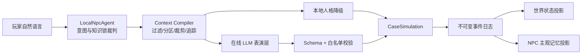

# Clause 13 AI NPC 工程设计

> 目标：把生成式 NPC 做成可控、可复现、可降级、可测试的游戏系统，而不是“角色卡 + 一段 Prompt”。

## 项目描述

- 设计并实现 Godot 4.6 + Python 的分层 AI NPC 架构，将身份答案、证据解锁、关系数值与协议结果保留在确定性状态机中，LLM 仅负责角色化表达和受限动作提案，避免模型幻觉改写谜题状态。
- 实现版本化 Context Compiler，将角色核心、场景模式、已授权信念、主观记忆、关系状态、导演意图与最近对话分区编译；先按知识锁做硬过滤，再按类型配额裁剪，并输出 included/dropped 原因与 section_chars 调试追踪。
- 基于不可变事件日志构建 NPC 主观记忆投影：每条记忆携带 event_id、salience、valence 与 tier，在保留角色偏见的同时维持客观事件锚点，支持重放与问题定位。
- 为在线对话加入 snapshot_version 乐观并发校验；当玩家在模型响应期间修改条款、重开案件或推进状态时，拒绝写入旧快照生成的回复，防止异步结果污染新世界状态。
- 使用 OpenAI Responses API 严格 JSON Schema 约束 utterance、action、referenced_ids 与 proposed_actions；服务端二次白名单过滤引用 ID 和动作类型，并通过 prompt_hash 记录可审计生成版本。
- 构建离线 LocalNpcAgent 降级链路，在无网络、无 API Key、超时或响应非法时仍由同一确定性语义裁判完成全部案件，保证核心玩法不依赖在线模型。
- 建立知识泄漏、隐藏答案隔离、事件—记忆来源关联、过期回复拒绝、协议与结局边界等自动化回归；当前包含 Godot 核心 50 项、UI 流程 1 项、Python 服务 5 项检查。

## 1. 系统边界

核心原则：游戏系统决定“发生了什么”，NPC 系统决定“角色如何理解和表达”。



LLM 无权修改以下状态：

- 来客是否为伪人；
- 证据是否解锁；
- 条款评分与协议是否接受；
- 信任、压迫、轮次和结局；
- 新人物、物品、地点或任务事实。

## 2. 模块划分

| 模块 | 文件 | 工程职责 |
|---|---|---|
| CaseSimulation | `scripts/core/case_simulation.gd` | 权威状态机、知识锁、协议裁决、事件提交、版本控制 |
| LocalNpcAgent | `scripts/services/local_npc_agent.gd` | 本地意图识别、话题判定、关系变化与可透露事实选择 |
| Context Compiler | `scripts/services/npc_context_compiler.gd` | 最小权限过滤、上下文分区、记忆/对话配额、导演意图与 trace |
| DialogueService | `scripts/services/dialogue_service.gd` | 健康检查、异步 HTTP、请求元数据、超时取消和本地降级 |
| Python Sidecar | `server.py` | 上下文白名单、Prompt 协议、Structured Outputs、结果校验、prompt_hash |
| Persona Data | `data/campaign.json` | 四名 NPC 的 persona_core、scene_modes、事实锁与语言素材 |

模块间只传递公开契约。`CaseSimulation` 内的 `is_impostor`、`safe_contract`、`npc_score` 和结局解释不会进入 Context Compiler。

## 3. 数据分层

| 数据层 | 当前实现 | 是否允许主观 | 写入者 |
|---|---|---:|---|
| 规范真相 | 案件身份、条款评分、结局答案 | 否 | campaign + CaseSimulation |
| 当前世界状态 | 轮次、证据、协议、关系、state_version | 否 | CaseSimulation |
| 不可变事件 | event_id、world_turn、source_version、committed_version | 否 | `_commit_event` |
| NPC 信念 | claim 与通过知识锁的 fact | 是 | Context Compiler 投影 |
| NPC 主观记忆 | subjective_text、salience、valence、event_id | 是 | 确定性 Memory Projection |
| 人格策略 | persona_core 与 scene_modes | 不属于事实 | campaign |
| 导演意图 | goal、priority、ttl、cooldown、forbidden_moves | 不属于知识 | Context Compiler |
| 调试追踪 | included_ids、dropped、section_chars、prompt_hash | 不进入角色认知 | Compiler + Sidecar |

世界真相、角色信念和主观记忆不会混在同一个文本池里。即使关系变化，记忆只能改变解释，不能覆盖原始 event_id。

## 4. Context Compiler

每轮对话按以下顺序编译：

1. 冻结 `case_id + snapshot_version`；
2. 本地语义裁判识别 intent、topic 和本轮 `reveal_id`；
3. 对事实执行知识锁硬过滤；
4. 只装入 claim、已解锁事实和本轮获准事实；
5. 装入最近 6 条主观记忆和 8 条对话；
6. 根据关系状态选择 active scene mode；
7. 生成带 TTL、优先级、提及次数和禁止动作的 director intent；
8. 输出 `prompt_trace`，记录被知识锁或预算裁掉的条目。

模型不会收到玩家档案全文。这样防止 NPC 因为“看见玩家 UI 上的风险标签”而意外知道自己不应知道的调查结论。

### 编译结果的主要分区

```text
SYSTEM_CONTRACT
CHARACTER_CORE
ACTIVE_SCENE_MODE
CURRENT_SCENE
KNOWN_BELIEFS
RELEVANT_MEMORIES
RELATIONSHIP_STATE
DIRECTOR_INTENT
AUTHORITATIVE_READ
RECENT_DIALOGUE
OUTPUT_CONTRACT
```

`AUTHORITATIVE_READ.semantic_anchor` 由本地规则生成，是本轮回答的语义锚点。LLM 可以改变措辞、节奏、动作和潜台词，不能改变锚点的事实含义。

## 5. 人格工程

每个 NPC 由两层数据组成：

- `persona_core`：身份、长期目标、核心特质、默认策略、语言节奏和稳定禁区；
- `scene_modes`：`watchful / open / guarded / threatening` 四种压力模式。

场景模式不是简单情绪标签，而是包含触发条件、行为策略、能量和少量短语料。信任与压迫只决定激活哪个模式，不能修改角色核心。

四个角色的差异化策略：

- 林岚：程序与可验证信息优先，受压时仍保持职业化；
- 槐姨：用亲密与环境意象包装危险条件，信任提高后承认部分风险但不洗白；
- 缝影人：把关系映射为工序、材料与欠账，尊重明确边界和公平工钱；
- 维斯：在火场时间压力下保持精确谈判，同时维护产权和人格尊严。

## 6. 事件溯源与主观记忆

所有有效操作通过 `_commit_event` 追加事件：

```text
event_id = case_id:event:next_version:event_type
source_version = 提交前版本
committed_version = 提交后版本
world_turn = 当前核验轮次
```

对话事件会生成独立的主观记忆条目：

```json
{
  "memory_id": "memory:rain_guest:event:0002:dialogue",
  "event_id": "rain_guest:event:0002:dialogue",
  "subjective_text": "核验员尝试理解我，并给出善意或保证。",
  "salience": 0.95,
  "valence": "positive",
  "tier": "recent"
}
```

明确承诺、威胁和交易获得更高显著度。Context Compiler 只取最近的有限条目，旧记忆因预算被裁剪时会进入 trace，而不会无声消失。

## 7. 异步一致性

在线请求携带：

- `case_id`；
- `turn_id`；
- `snapshot_version`。

模型返回后，`talk_with_reply` 会再次比较当前版本。条款修改、协议提交、重开案件或其他事件只要推进了版本，旧回复就会被拒绝，不消耗轮次也不写入记忆。

这相当于对单机异步生成使用轻量乐观并发控制，解决“请求发出后世界已经变化”的竞态问题。

## 8. 输出校验与最小权限

在线模型严格返回：

```json
{
  "utterance": "玩家可见台词",
  "action": "玩家可见动作",
  "referenced_ids": ["belief_id", "memory_id"],
  "proposed_actions": [
    {
      "type": "gesture | request_clarification | refuse",
      "target": "对象",
      "reason_code": "受控原因码"
    }
  ]
}
```

服务端不会相信“通过 Schema 的 JSON 就一定正确”，还会执行第二次校验：

- `referenced_ids` 必须属于本轮实际注入的信念或记忆；
- 动作类型和 reason_code 必须在白名单；
- 每轮最多两个动作提案；
- 所有文本再次执行长度限制；
- 非法引用和动作被丢弃，不写入游戏状态。

## 9. 可观测性

当前可复现信息包括：

- snapshot_version 与 turn_id；
- 被装入的 belief_id / memory_id；
- 被知识锁、记忆预算和对话预算裁掉的条目及原因；
- 各上下文分区字符数；
- Context Compiler 版本；
- 模型名称、provider、referenced_ids、proposed_actions；
- Prompt 输入的 SHA-256 短哈希。

这些数据保存在事件的 `generation_trace` 或请求上下文中，不进入玩家可见台词。

## 10. 降级与故障策略

| 故障 | 行为 |
|---|---|
| 未配置 API Key | 启动时标记本地模式 |
| 健康检查失败 | 使用 LocalNpcAgent |
| HTTP 无法启动/超时/非 2xx | 当前轮降级，不中断案件 |
| JSON 或 Structured Output 无效 | 丢弃在线结果，使用本地回复 |
| 上下文版本过期 | 拒绝提交，要求重新提问 |
| 非法引用或动作 | 服务端白名单过滤 |

核心案件可在完全离线状态通关，AI 服务只增强表达质量，不成为单点故障。

## 11. 自动化测试

当前回归覆盖：

- 公开快照不包含 `is_impostor`、`safe_contract`、`npc_score`；
- Context Compiler 不传入玩家档案和任务答案；
- 未解锁信念被硬过滤并记录 dropped reason；
- 当前通过知识锁的事实进入 KNOWN_BELIEFS；
- 主观记忆与客观 event_id 保持来源关联；
- 明确承诺获得高 salience；
- 旧 snapshot 的在线回复不能修改新状态；
- Structured Outputs Schema 严格且字段完整；
- 未授权 referenced_id 与动作提案被剔除；
- 在线服务失败不影响本地案件结局。

运行方式：

```powershell
godot --headless --path . res://tests/case_simulation_test.tscn
godot --headless --path . res://tests/ui_progression_test.tscn
python -m unittest discover -s tests -p 'test_*.py' -v
```

## 12. 面试时的设计取舍

### 为什么没有使用向量数据库

当前只有四个案件和少量证据，主要风险是 NPC 看到不该知道的信息，不是语义召回率不足。优先使用身份、案件、知识锁和任务阶段的确定性过滤；当事实规模达到数百条并出现真实语义召回需求时，再增加 Embedding，不为简历关键词提前增加基础设施。

### 为什么不让 LLM 直接更新世界

身份判断和证据链要求可复现、可回滚、可测试。LLM 擅长理解和表演，不擅长事务、幂等和长期事实一致性，因此只开放表达与白名单动作提案。

### 为什么仍保留本地语义裁判

它同时承担玩法权威和故障降级：即使模型不可用，玩家的自由输入仍能改变信任、压迫、话题和证据解锁，完整核心循环不受影响。

## 13. 当前没有声称完成的能力

为避免简历过度包装，当前版本没有声称实现：

- 向量数据库或大规模语义检索；
- 多 NPC 同场全局调度；
- 跨存档、跨循环长期记忆；
- LLM 自动改写人格或权威世界状态；
- 在线并发压测和生产级数据库持久化。

这些可以作为下一阶段扩展，但不应写成已经完成的项目成果。
