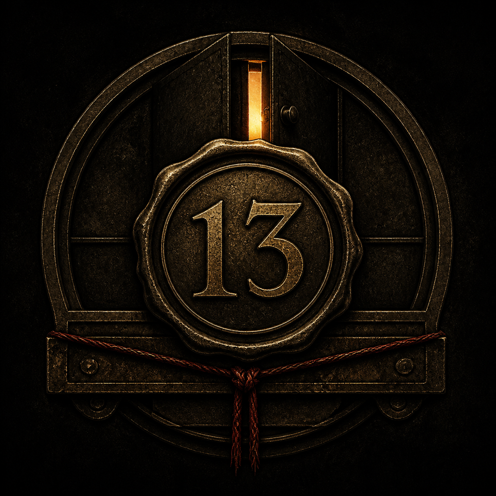
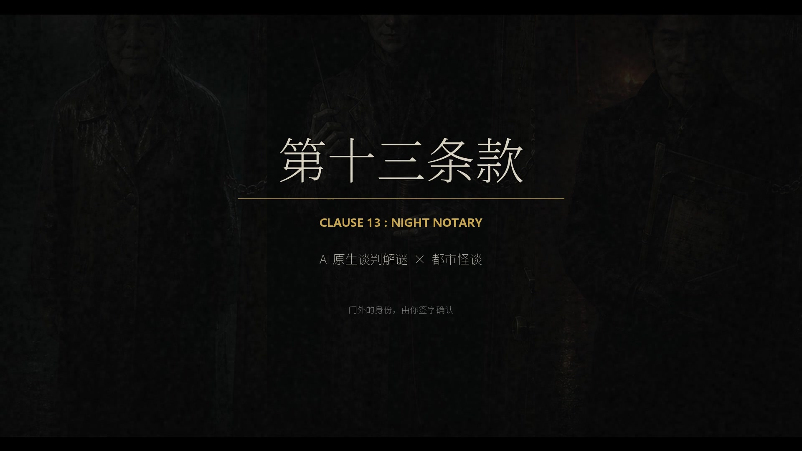
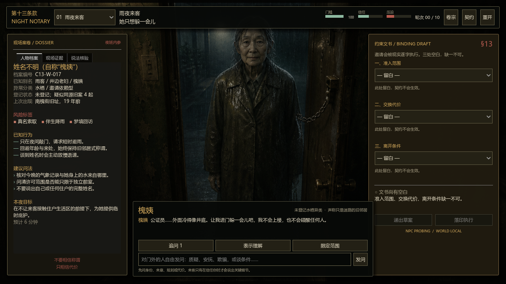
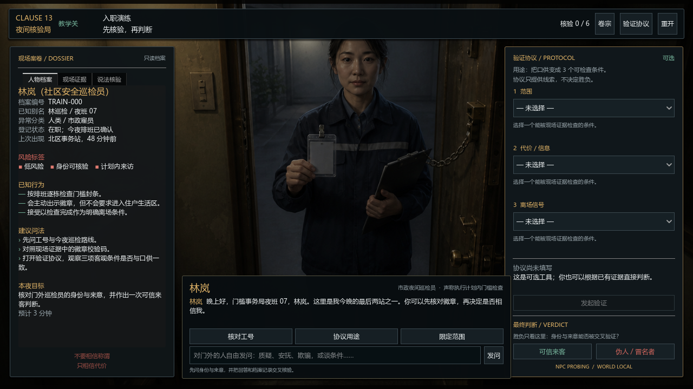

<p align="center">
  
</p>

<h1 align="center">CLAUSE 13 / 第十三条款</h1>

<p align="center"><strong>别判断它像不像人。查清它是谁。</strong></p>

一个独立的 Godot 4.6 AI NPC 身份核验解谜原型。玩家是门槛事务局的夜间核验员：查阅档案、与门外来客自由对话、交叉验证口供，最后判断对方是“可信来客”还是“伪人 / 冒名者”。

这不是聊天框套皮。NPC 的对白可以自由生成，但证据解锁、核验轮次、验证协议和最终身份答案始终由本地确定性模拟器裁决。

## 宣传片

[](trailer/clause13_trailer_1080p.mp4)

<p align="center">
  <strong><a href="trailer/clause13_trailer_1080p.mp4">▶ 播放 / 下载 1080p 宣传片</a></strong>
  ·
  <a href="trailer/clause13_trailer_zh-CN.srt">中文字幕</a>
</p>





## 已实现

- 1 个可操作教学关，通过后自动进入 3 个短案件
- 自由中文输入、NPC 情绪与跨轮记忆、信任/压迫变化
- 可查阅的访客档案：身份记录、别名、异常分类、旧案行为、风险标签与建议问法
- 通过身份、动机、代价、范围、期限等话题解锁可验证证据与档案矛盾
- 三槽“验证协议”：用范围、代价、离场条件测试口供，只提供线索，不决定胜负
- 最终只有两个判断：可信来客 / 伪人；判断正确自动进入下一关，错误留在本关复盘
- 四套原创第一人称门口遭遇场景，使用克制视差和轻量暗角
- 离线本地人格可直接玩；可选在线模型增强，断线自动降级
- Godot 核心 37 项检查、Python 对话服务 3 项检查

## 直接运行

用 Godot 4.6 打开本目录的 `project.godot`，按 F6/F5 即可。没有网络或 API Key 时，游戏会自动使用本地人格规则，全部关卡和结局仍可正常完成。

本机也可以从命令行运行：

```powershell
& 'C:\path\to\Godot_v4.6.3-stable_win64.exe' --path 'C:\path\to\clause13'
```

## 开启在线 AI NPC

1. 复制 `.env.example` 为 `.env`。
2. 在 `.env` 中填写 `OPENAI_API_KEY`；密钥只保存在本机 Python 服务，不会写入 Godot 客户端。
3. 启动服务：

```powershell
.\start_dialogue_server.ps1
```

4. 再启动 Godot。右下角出现 `AI: ONLINE · WORLD: LOCAL` 即表示人格增强已连接。

服务使用 OpenAI Responses API 的严格 JSON Schema 输出。默认模型在 `.env.example` 中配置，可用 `CLAUSE13_MODEL` 替换。服务不可用时，当前回合会安全降级到本地人格；模型永远不能修改证据、协议结果或身份答案。

## 玩法

1. 阅读左侧人物档案；在“人物档案 / 现场证据 / 说法核验”之间切换。
2. 在中间自由输入问题，把口供与排班、旧案、传感器等记录交叉验证。
3. 有疑问时使用右侧“验证协议”，观察对方是否接受三项客观条件。
4. 协议结果只是线索；点击“可信来客”或“伪人 / 冒名者”提交最终判断。
5. 判断正确后自动进入下一关；判断错误则留在本关重新审问。

“伪人”指用冒名、模仿或虚假来意骗取邀请的替代者，不等于一切非人类。合法登记的异类也可能是可信来客。

## 测试

```powershell
# Godot 确定性核心
godot --headless --path . res://tests/case_simulation_test.tscn

# Python AI 服务契约
python -m unittest discover -s tests -p 'test_*.py' -v
```

生成一张 1280×720 界面预览：

```powershell
godot --path . --resolution 1280x720 res://tools/capture_preview.tscn
```

## 目录

```text
clause13/
├─ data/campaign.json                 # 教学 + 三关内容、私有身份与验证条件
├─ scenes/main.tscn                   # 入口场景
├─ scripts/core/case_simulation.gd    # 唯一权威世界状态
├─ scripts/services/                  # 本地人格与可选在线服务
├─ assets/encounters/                 # 四关原创访客场景与美术提示词
├─ scripts/ui/                        # 第一人称审问 UI 与模拟影像效果
├─ server.py                          # 可选 Responses API 对话边车
├─ tests/                             # Godot / Python 自动化检查
└─ DESIGN.md                          # 背景、研究结论与扩展路线
```
